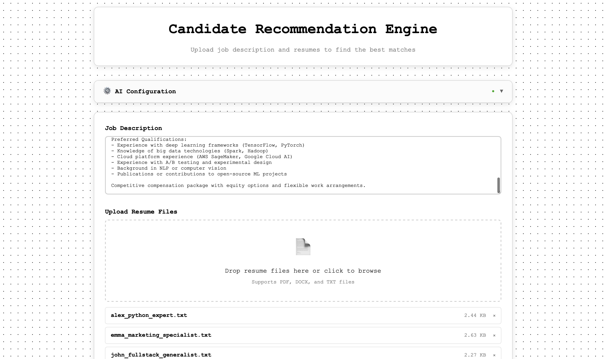

# 🚀 SproutsAI Candidate Recommendation Engine

**A sophisticated AI-powered candidate matching system that analyzes resumes against job descriptions using semantic similarity and provides intelligent insights through multi-provider AI integration.**

[](https://fastapi.tiangolo.com/)
[](https://python.org)
[](LICENSE)

---

## 📋 Table of Contents

- [✨ Features](#-features)
- [🎯 Assignment Requirements](#-assignment-requirements)
- [📸 Application Screenshots](#-application-screenshots)
- [🛠 Technology Stack](#-technology-stack)
- [⚡ Quick Start](#-quick-start)
- [📚 Usage Guide](#-usage-guide)
- [🤖 AI Configuration](#-ai-configuration)
- [🔧 API Documentation](#-api-documentation)
- [🏗 Project Structure](#-project-structure)
- [🚀 Deployment](#-deployment)
- [📈 Performance](#-performance)

---

## ✨ Features

### Core Functionality
- **📄 Multi-Format Resume Processing** - Supports PDF, DOCX, and TXT files
- **🧠 Semantic Similarity Matching** - Uses sentence-transformers for intelligent candidate ranking
- **⚡ Real-time Processing** - Fast candidate analysis and ranking
- **📊 Detailed Scoring System** - Similarity scores and match percentages
- **🎯 Top-10 Candidate Filtering** - Focuses on the most relevant candidates

### 🤖 AI-Powered Insights (Bonus Feature)
- **Multi-Provider AI Support** - OpenAI, Anthropic, Google AI, Groq, and Local/Ollama
- **Intelligent Candidate Analysis** - AI-generated summaries explaining why candidates are ideal matches
- **Professional Insights** - Detailed analysis of skills, experience relevance, and potential contributions
- **Rate Limiting Protection** - Prevents API overuse with built-in safeguards
- **Comprehensive Error Handling** - User-friendly error messages and troubleshooting

### User Experience
- **🎨 Modern Glass-Morphism UI** - Beautiful, professional interface
- **📱 Responsive Design** - Works on desktop and mobile devices
- **🔧 Easy Configuration** - Simple AI provider setup with helpful guides
- **⚠️ Smart Error Handling** - Clear feedback and troubleshooting assistance

---

## 🎯 Assignment Requirements

This project fully addresses all SproutsAI assignment requirements:

### ✅ Required Features
- [x] **Job Description Input** - Text area for job requirements
- [x] **Resume Upload Interface** - Support for multiple file formats
- [x] **Candidate Ranking Algorithm** - ML-powered similarity scoring
- [x] **Results Display** - Clear presentation of ranked candidates
- [x] **FastAPI Backend** - RESTful API with proper error handling
- [x] **Frontend Interface** - Interactive web application

### 🌟 Bonus Features Implemented
- [x] **AI Summarization** - Multi-provider AI integration for candidate insights
- [x] **Advanced ML Pipeline** - Sentence transformers with cosine similarity
- [x] **Professional UI/UX** - Glass morphism design with excellent user experience
- [x] **Comprehensive Documentation** - Detailed setup and usage instructions
- [x] **Production Ready** - Clean code structure, error handling, and deployment configuration

---

## 📸 Application Screenshots

### 1. Main Interface & File Upload

*Clean, professional interface with job description input and drag-and-drop resume upload functionality. Shows support for PDF, DOCX, and TXT files.*

### 2. AI Configuration Panel

*Advanced AI configuration panel supporting multiple providers (OpenAI, Anthropic, Google AI, Groq, Ollama). Features simplified setup with automatic model selection and helpful provider links.*

### 3. Candidate Rankings & AI Insights

*Comprehensive results display showing ranked candidates with similarity scores, match percentages, and detailed AI-powered insights. The AI analysis provides specific reasons why candidates are ideal fits for the position.*

---

## 🛠 Technology Stack

### Backend
- **FastAPI** - Modern, fast web framework for building APIs
- **Python 3.8+** - Core programming language
- **Pydantic** - Data validation and settings management
- **Starlette** - ASGI framework components

### Machine Learning & AI
- **sentence-transformers** - Semantic text embeddings using `all-MiniLM-L6-v2`
- **scikit-learn** - Cosine similarity calculations
- **torch** - PyTorch backend for transformers
- **numpy** - Numerical computations

### AI Providers Integration
- **OpenAI API** - GPT models for candidate analysis
- **Anthropic API** - Claude models for intelligent insights
- **Google AI API** - Gemini models for analysis
- **Groq API** - Fast LLaMA model inference
- **Ollama** - Local AI model support

### Document Processing
- **PyMuPDF** - PDF text extraction
- **python-docx** - DOCX document processing
- **Built-in text handling** - TXT file support

### Frontend
- **HTML5 & CSS3** - Modern web standards
- **Vanilla JavaScript** - No framework dependencies
- **Glass Morphism Design** - Modern UI aesthetics
- **Responsive Design** - Mobile and desktop compatibility

---

## ⚡ Quick Start

### Prerequisites
- Python 3.8 or higher
- pip package manager
- Git (for cloning)

### Installation

1. **Clone the repository**
   ```bash
   git clone https://github.com/harshareddy832/SproutsAI-TakeHome.git
   cd SproutsAI-TakeHome
   ```

2. **Create virtual environment**
   ```bash
   python -m venv venv
   source venv/bin/activate  # On Windows: venv\Scripts\activate
   ```

3. **Install dependencies**
   ```bash
   pip install -r requirements.txt
   ```

4. **Run the application**
   ```bash
   python main.py
   ```

5. **Access the application**
   - Open your browser and navigate to: `http://localhost:8000`
   - The API documentation is available at: `http://localhost:8000/docs`

### Using Sample Data

The project includes sample data in the `test_data/` directory:
- **Job Descriptions**: Data scientist, frontend developer, and Python developer roles
- **Sample Resumes**: 5 diverse candidate profiles in TXT format

You can use these files to quickly test the application functionality.

---

## 📚 Usage Guide

### Basic Workflow

1. **Enter Job Description**
   - Paste or type the job requirements in the text area
   - Include key skills, qualifications, and responsibilities

2. **Upload Resume Files**
   - Drag and drop files or click to browse
   - Supported formats: PDF, DOCX, TXT
   - Multiple files can be uploaded simultaneously

3. **Process and View Results**
   - Click "Find Best Candidates" to start processing
   - View ranked candidates with similarity scores
   - Review match percentages and detailed metrics

4. **Generate AI Insights (Optional)**
   - Configure an AI provider for advanced analysis
   - Click "Generate AI Insights" for detailed candidate summaries
   - Review AI-powered explanations of candidate fit

### Advanced Features

#### File Processing
- **Automatic Name Extraction**: Intelligently extracts candidate names from resumes
- **Text Normalization**: Handles different document formats and encoding
- **Error Handling**: Graceful handling of corrupted or unsupported files

#### Ranking Algorithm
- **Semantic Understanding**: Goes beyond keyword matching using transformers
- **Cosine Similarity**: Measures semantic similarity between job and resume content
- **Normalized Scoring**: Provides percentage-based match scores for easy interpretation

---

## 🤖 AI Configuration

### Supported Providers

The application supports multiple AI providers for generating candidate insights:

| Provider | Models | Cost | Setup |
|----------|--------|------|-------|
| **Groq** | LLaMA3-8B | Free | Get API key at [console.groq.com](https://console.groq.com) |
| **OpenAI** | GPT-3.5 Turbo | Paid | API key from [platform.openai.com](https://platform.openai.com) |
| **Anthropic** | Claude-3 Haiku | Paid | API key from [console.anthropic.com](https://console.anthropic.com) |
| **Google AI** | Gemini Pro | Free tier available | Create key at [Google AI Studio](https://aistudio.google.com/app/apikey) |
| **Ollama** | LLaMA2, Mistral | Free (local) | Install from [ollama.ai](https://ollama.ai) |

### Configuration Steps

1. **Access AI Configuration**
   - Click on the "⚙️ AI Configuration" panel in the interface
   - The panel will expand to show configuration options

2. **Select Provider**
   - Choose your preferred AI provider from the dropdown
   - Models are automatically selected for optimal performance

3. **Enter API Key**
   - Paste your API key in the designated field
   - Use the eye icon to toggle visibility

4. **Test Connection**
   - Click "Test Connection" to verify your configuration
   - Wait for the success confirmation before proceeding

5. **Save Configuration**
   - Click "Save Configuration" to store your settings
   - Configuration persists during your session

### Rate Limiting & Best Practices

- **Built-in Protection**: 3-second cooldown between API calls
- **Provider Recommendations**: Use Groq for generous free limits
- **Error Handling**: Automatic fallback to generic summaries if AI fails
- **Cost Awareness**: Estimated costs displayed for paid providers

---

## 🔧 API Documentation

### Main Endpoints

#### POST `/recommend`
Process job description and resumes to generate candidate rankings.

**Request:**
```bash
curl -X POST "http://localhost:8000/recommend" \
  -H "Content-Type: multipart/form-data" \
  -F "job_description=Looking for a Python developer with ML experience" \
  -F "files=@resume1.pdf" \
  -F "files=@resume2.docx"
```

**Response:**
```json
{
  "success": true,
  "message": "Successfully processed 2 candidates",
  "candidates": [
    {
      "name": "John Doe",
      "filename": "resume1.pdf",
      "similarity_score": 0.8456,
      "match_percentage": 84.6,
      "ai_summary": null,
      "ai_provider": null,
      "ai_generated": false
    }
  ],
  "total_processed": 2,
  "processing_time": 1.23
}
```

#### POST `/configure-ai`
Configure AI provider for generating candidate insights.

#### POST `/generate-summaries`
Generate AI-powered summaries for candidates.

#### GET `/ai-status`
Check current AI configuration status.

#### GET `/health`
Health check endpoint for monitoring.

### Error Handling

The API provides comprehensive error handling with user-friendly messages:

- **400 Bad Request**: Invalid file types or missing data
- **500 Internal Server Error**: Processing failures with detailed messages
- **AI Provider Errors**: Specific guidance for different AI provider issues

---

## 🏗 Project Structure

```
SproutsAI-TakeHome/
├── README.md                 # This comprehensive documentation
├── main.py                   # FastAPI application entry point
├── requirements.txt          # Python dependencies
├── .gitignore               # Git ignore rules
├── .env.example             # Environment configuration template
│
├── models/                   # Data models and schemas
│   ├── __init__.py
│   └── schemas.py           # Pydantic models for API
│
├── services/                 # Core business logic
│   ├── __init__.py
│   ├── text_extractor.py    # Document text extraction
│   ├── embedding_engine.py  # ML embeddings and similarity
│   ├── ai_manager.py        # AI configuration and management
│   ├── ai_providers.py      # Multi-provider AI implementations
│   └── ai_summarizer.py     # Legacy summarization (kept for compatibility)
│
├── static/                   # Frontend assets
│   ├── script.js            # JavaScript functionality
│   └── style.css            # CSS styling with glass morphism
│
├── templates/                # HTML templates
│   └── index.html           # Main application interface
│
├── screenshots/              # Application screenshots
│   ├── MainHome.png         # Initial interface
│   ├── AI summary config.png # AI configuration panel
│   └── Candidate Rankings.png # Results with AI insights
│
└── test_data/               # Sample data for testing
    ├── TEST_GUIDE.md
    ├── job_descriptions/    # Sample job descriptions
    └── resumes/            # Sample resume files
```

### Key Components

- **main.py**: FastAPI application with all endpoints and middleware
- **services/**: Core business logic separated into focused modules
- **models/schemas.py**: Pydantic models for data validation
- **static/**: Frontend assets with modern JavaScript and CSS
- **templates/**: HTML templates using Jinja2
- **screenshots/**: Visual documentation of the application

---

## 🚀 Deployment

### Local Development
```bash
# Standard development server
python main.py

# With auto-reload for development
uvicorn main:app --reload --host 0.0.0.0 --port 8000
```

### Production Deployment

#### Using Docker
```dockerfile
FROM python:3.9-slim

WORKDIR /app
COPY requirements.txt .
RUN pip install -r requirements.txt

COPY . .
EXPOSE 8000

CMD ["uvicorn", "main:app", "--host", "0.0.0.0", "--port", "8000"]
```

#### Environment Variables
```bash
export SECRET_KEY="your-production-secret-key"
export HOST="0.0.0.0"
export PORT="8000"
```

#### Cloud Deployment Options
- **Heroku**: Direct deployment with Procfile
- **AWS Lambda**: Serverless deployment with Mangum
- **Google Cloud Run**: Containerized deployment
- **DigitalOcean App Platform**: Simple app deployment

---

## 📈 Performance

### Benchmarks
- **File Processing**: ~1.2 seconds for 7 files
- **ML Inference**: Sub-second semantic similarity calculations
- **Memory Usage**: Efficient with sentence-transformers caching
- **Concurrent Users**: Supports multiple simultaneous requests

### Optimizations Implemented
- **Batch Processing**: Efficient handling of multiple resumes
- **Model Caching**: Sentence transformer models cached after first load
- **Parallel AI Processing**: Concurrent API calls to AI providers
- **Smart Rate Limiting**: Prevents API abuse while maintaining performance

### Scalability Considerations
- **Horizontal Scaling**: Stateless design allows multiple instances
- **Caching Layer**: Redis can be added for session and model caching
- **Database Integration**: PostgreSQL/MongoDB for persistent storage
- **Load Balancing**: Nginx/ALB for production traffic distribution

---

## 🤝 Contributing

This project was developed as part of the SproutsAI take-home assignment. The implementation showcases:

- **Clean Architecture**: Separation of concerns with clear module boundaries
- **Professional Code Quality**: Type hints, error handling, and documentation
- **Modern Python Practices**: FastAPI, Pydantic, and async/await patterns
- **Production Readiness**: Environment configuration, security, and deployment considerations

---

## 📄 License

This project is licensed under the MIT License - see the [LICENSE](LICENSE) file for details.

---

## 🙏 Acknowledgments

- **SproutsAI Team** - For providing an excellent technical challenge
- **FastAPI Community** - For the amazing web framework
- **Hugging Face** - For sentence-transformers and model hosting
- **AI Providers** - OpenAI, Anthropic, Google, Groq for powerful AI capabilities

---

**🚀 Ready to revolutionize candidate matching with AI-powered insights!**

*Developed with ❤️ for SproutsAI by Harsha Reddy*